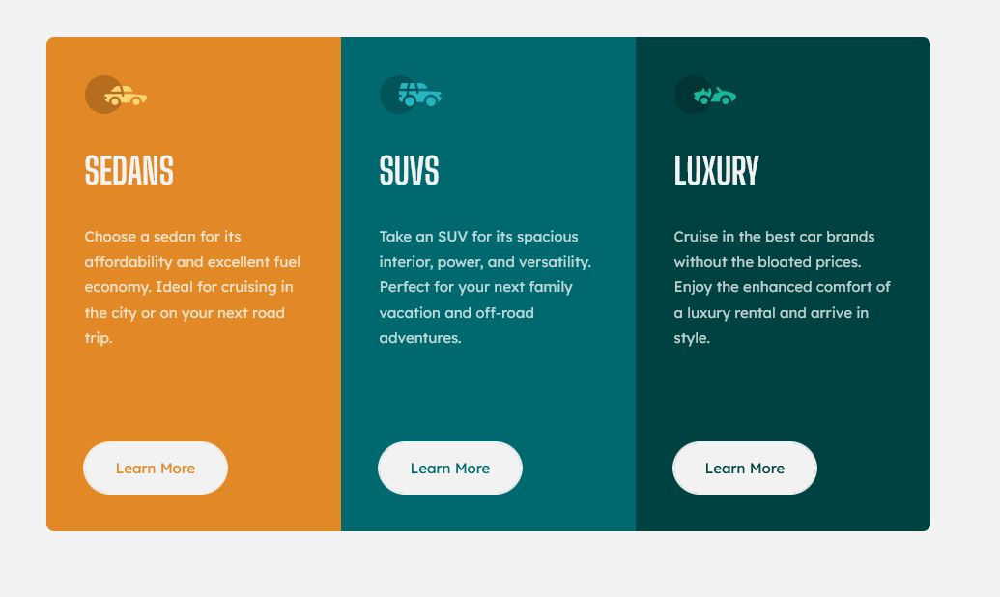

# Frontend Mentor - 3-column preview card component solution

This is a solution to the [3-column preview card component challenge on Frontend Mentor](https://www.frontendmentor.io/challenges/3column-preview-card-component-pH92eAR2-). Frontend Mentor challenges help you improve your coding skills by building realistic projects. 

## Table of contents

- [Overview](#overview)
  - [The challenge](#the-challenge)
  - [Screenshot](#screenshot)
  - [Links](#links)
- [My process](#my-process)
  - [Built with](#built-with)
  - [What I learned](#what-i-learned)
  - [Useful resources](#useful-resources)
- [Author](#author)


## Overview

### The challenge

Users should be able to:

- View the optimal layout depending on their device's screen size
- See hover states for interactive elements

### Screenshot




### Links

- Solution URL: [Github URL](https://github.com/Quakumei/FM-3-column-preview-card)
- Live Site URL: [Live site URL](https://fm-3-column-preview-card-quakumei.vercel.app/)

## My process

### Built with

- Semantic HTML5 markup
- CSS custom properties
- Flexbox
- Mobile-first workflow


### What I learned

 - Using last-child / nth-child / first-child in adaptive
 ```css
 @media only screen and (min-width:915px) {
    body {
        height: 100vh;
    }
    main {
        margin: 0;
        flex-direction: row;
    }

    .car-card:last-child {
        border-radius: 0 var(--radii) var(--radii) 0;
    }

    .car-card:first-child {
        border-radius:  var(--radii) 0 0 var(--radii);
    }

    .car-card__description {
        margin-bottom: 6rem;
    }

}
```

- How to make a button with fully round sides + outline property 
```css
.car-card__button {
    display: block;
    background-color: var(--gray);
    padding: 1rem 2rem;
    width:fit-content;
    text-align: center;
    border-radius: var(calc(2rem + 15px));
    outline: 2px solid var(--gray);
    transition: all 0.3s ease-in-out;
}

.car-card__button:hover {
    outline: 2px solid var(--gray);
    background-color: transparent;
    cursor:pointer;
}
```


### Useful resources

- [Using outline css property](https://stackoverflow.com/questions/9601357/placing-border-inside-of-div-and-not-on-its-edge) - This helped me leave a border of a button when hovering over it.

## Author

- Frontend Mentor - [@Quakumei](https://www.frontendmentor.io/profile/Quakumei)
- Github - [@Quakumei](https://github.com/Quakumei)
